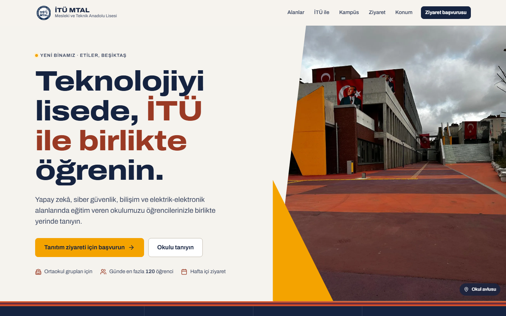

# İTÜ MTAL · Okul Tanıtım Ziyareti

İstanbul Teknik Üniversitesi Mesleki ve Teknik Anadolu Lisesi için tanıtım sitesi ve ziyaret başvuru sistemi.

**Canlı site:** https://cafu1107.github.io/itumtal/ · **Panel:** https://cafu1107.github.io/itumtal/panel/



## Ne yapar?

- **Tanıtım sitesi:** okulun dört alanı (Yapay Zekâ, Siber Güvenlik, Bilişim Teknolojileri, Elektrik-Elektronik Teknolojisi), İTÜ iş birliği, Etiler'deki yeni bina ve konum.
- **Ziyaret başvurusu:** ortaokul öğretmenleri öğrenci sayısını yazar, takvimden en fazla 3 uygun gün seçer, okul ve iletişim bilgilerini girer. Takvim her gün için kalan kontenjanı gösterir ve grubun sığmadığı günleri kapatır.
- **Başvuru takibi:** öğretmene bir başvuru kodu ve takip bağlantısı verilir. Bu bağlantıdan durumu, onaylanan gün ve saati, okulun notunu görür. Ziyareti takvimine ekleyebilir ya da iptal edebilir.
- **Rehberlik paneli** (`/panel`):
  - Başvurular bekleyen, onaylı, reddedilen ve iptal olarak ayrılır; liste aranabilir ve CSV olarak indirilebilir.
  - Her başvuruda tek dokunuşla arama, WhatsApp (hazır mesajla), e-posta ve takip bağlantısını kopyalama düğmeleri var.
  - Ziyaret planlanırken gün ve saat seçilir, günlük kontenjan göstergesi görünür, kontenjan aşılacaksa onay istenir.
  - Reddetme, iptal etme ve yeniden değerlendirme yapılabilir. Yalnızca panelde görünen iç notlar tutulur, her başvurunun işlem geçmişi kaydedilir.
  - Aylık takvim, onaylı ziyaretleri ve bekleyen taleplerin tercih ettiği günleri gösterir.
  - Ayarlar: günlük kontenjan (varsayılan 120), ziyaret günleri, en erken ve en geç başvuru süresi, dönem sonu, kapalı günler, formu açma/kapatma, form duyurusu, şifre değiştirme.
  - Yönetici hesapları ayrıca panel hesaplarını yönetebilir.

## Yapı

| Klasör | İçerik |
| --- | --- |
| `site/` | Statik site: HTML, CSS, vanilla JS (ES modülleri). GitHub Pages'e olduğu gibi yayınlanır. |
| `worker/` | Cloudflare Worker + D1 (SQLite) API'si. `src/lib.mjs` saf mantık, `src/index.mjs` uç noktalar. |
| `scripts/` | `images.py` (fotoğrafları kırpar, WebP üretir), `seed-user.mjs` (panel hesabı oluşturur / şifre sıfırlar). |

Güvenlik:

- Şifreler PBKDF2-SHA256 ile saklanır. Oturum anahtarlarının veritabanında yalnızca hash'i tutulur ve oturumlar 12 saat sürer.
- Art arda 5 hatalı girişte hesap 15 dakika kilitlenir.
- IP başına istek sınırı var. Formda bot tuzağı (honeypot) ve en kısa doldurma süresi kontrolü bulunur.
- CORS yalnızca sitenin adresine açıktır.

## Yerelde çalıştırma

```bash
cd worker
npm install
npm run migrate:local
node ../scripts/seed-user.mjs admin "Yönetici" admin <şifre>      # yerel hesap
npm run dev                                                        # API: http://127.0.0.1:8787

# ayrı bir terminalde
python -m http.server 5500 --directory site                        # Site: http://localhost:5500
```

Site `localhost` üzerinde açıldığında yerel API'yi, aksi hâlde canlı Worker'ı kullanır (`site/assets/js/common.js`).

Testler:

```bash
cd worker
npm test                                                           # birim testleri
ADMIN_PASSWORD=... STAFF_PASSWORD=... node test/api.integration.mjs  # yerel API'ye uçtan uca
```

## Yayınlama

- **Site:** `main` dalına her push'ta GitHub Actions testleri çalıştırır ve `site/` klasörünü Pages'e yayınlar.
- **API:** `cd worker && npm run deploy`. Şema değiştiyse önce `npm run migrate:remote` çalıştırılır.
- **Hesap ekleme veya şifre sıfırlama:** panelde *Ayarlar → Hesaplar* bölümünden ya da `node scripts/seed-user.mjs <kullanıcı> "<Ad>" <admin|staff> <şifre> --remote` komutuyla.

Başka bir alan adına taşırken:

1. `worker/wrangler.toml` içindeki `ALLOWED_ORIGINS` listesine yeni adresi ekleyin.
2. API de başka bir adrese taşınacaksa `site/assets/js/common.js` içindeki `API_BASE` değerini güncelleyin.
3. Worker'ı yeniden yayınlayın.

## Kaynaklar

Okulla ilgili bilgiler İstanbul İl Millî Eğitim Müdürlüğü'nün 23.07.2026 tarihli "İTÜ MTAL yeni binasında geleceğe hazırlanıyor" duyurusundan alınmıştır. Okul logosu okulun izniyle kullanılmaktadır.
