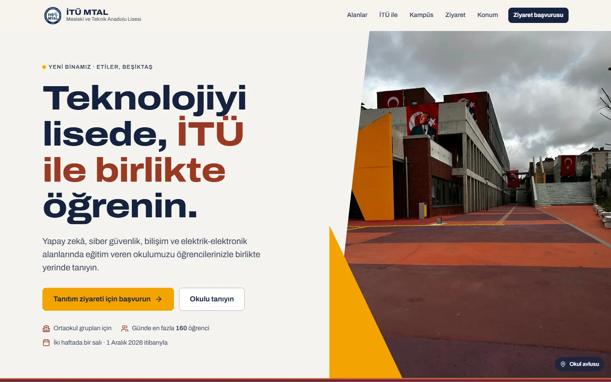
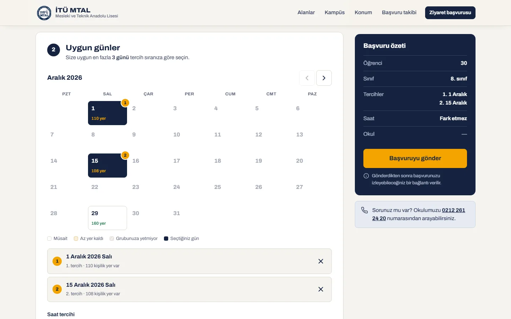
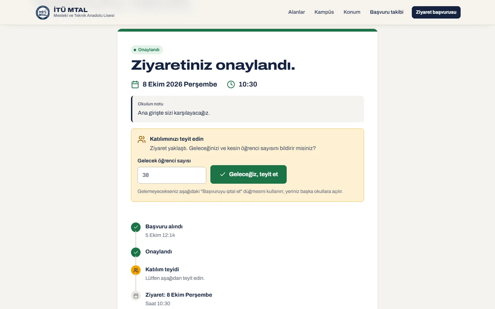
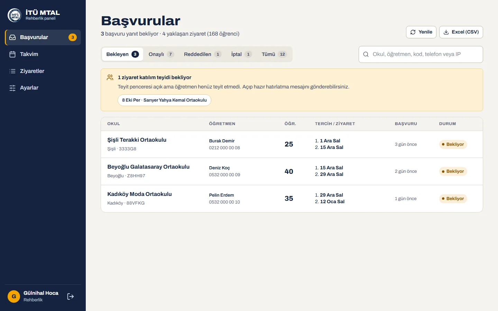
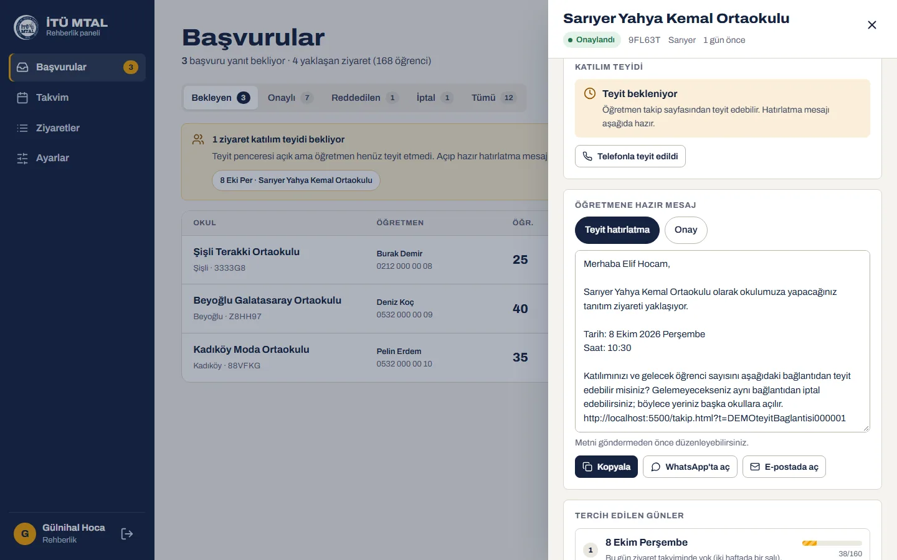
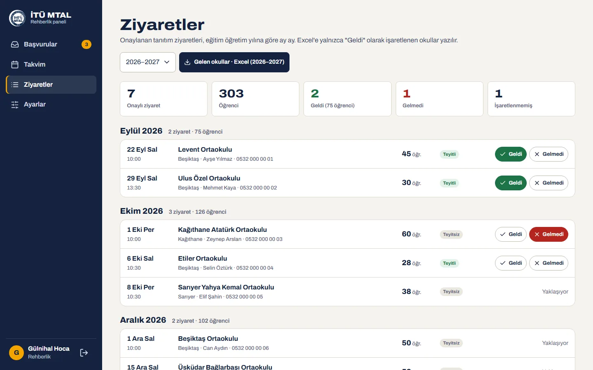
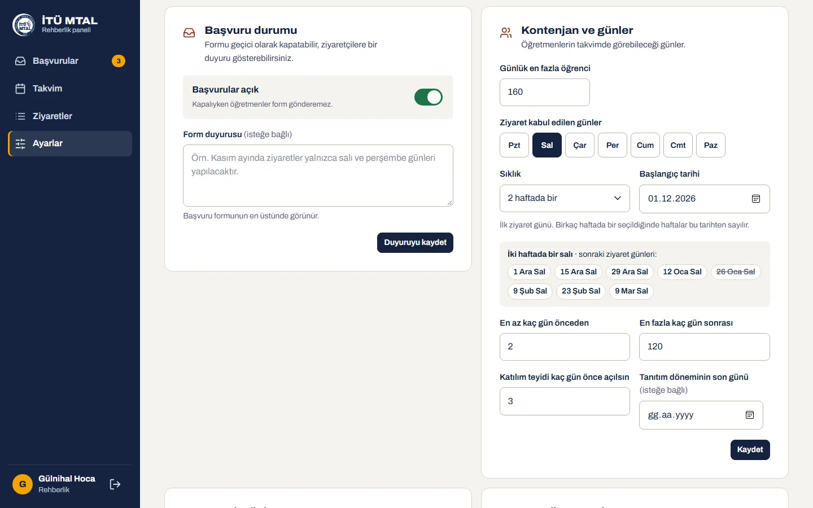
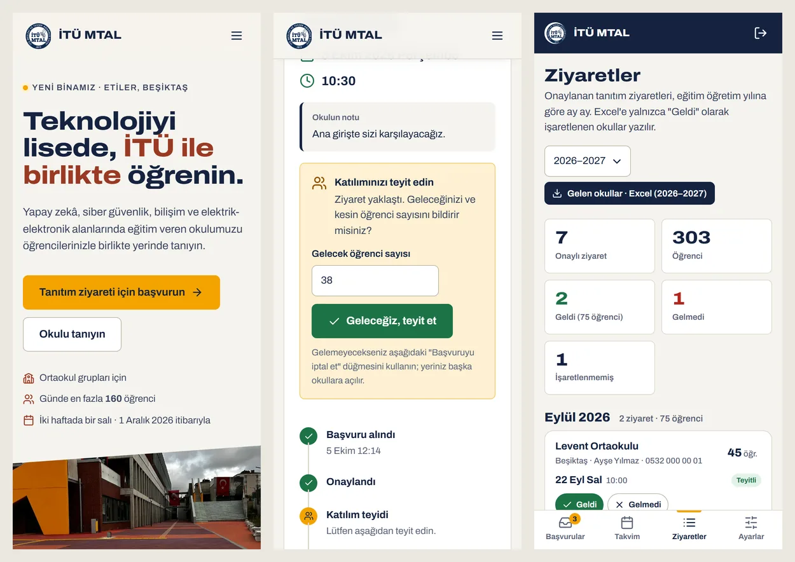

<p align="center">
  
</p>

<h1 align="center">İTÜ MTAL · Okul Tanıtım Ziyareti</h1>

<p align="center">
  İstanbul Teknik Üniversitesi Mesleki ve Teknik Anadolu Lisesi'nin tanıtım sitesi, ortaokullar için çevrim içi ziyaret başvurusu<br>
  ve rehberlik servisinin başvuruları onaylayıp takip ettiği yönetim paneli.
</p>

<p align="center">
  <a href="https://cafu1107.github.io/itumtal/"></a>
  <a href="https://cafu1107.github.io/itumtal/basvuru.html"></a>
  <a href="https://github.com/Cafu1107/itumtal/releases/latest/download/ITU-MTAL-Tanitim.zip"></a>
</p>

<p align="center">
  <a href="https://github.com/Cafu1107/itumtal/actions/workflows/pages.yml"></a>
  <a href="https://github.com/Cafu1107/itumtal/releases/latest"></a>
  
  
  <a href="LICENSE"></a>
</p>

---

## Ne yapar?

| 🏫 Ziyaretçiler için | ✍️ Başvuran öğretmenler için | 🧭 Rehberlik servisi için |
| --- | --- | --- |
| Okulun dört alanı (Yapay Zekâ, Siber Güvenlik, Bilişim, Elektrik-Elektronik), İTÜ iş birliği ve Etiler'deki yeni bina | Öğrenci sayısını yazıp takvimden en fazla 3 uygun gün seçme; takvim her gün için kalan kontenjanı gösterir | Başvuruları onaylama, reddetme, iptal etme; telefon, WhatsApp ve e-posta düğmeleri |
| **Nasıl gelirim?** Adres ya da okul adı yazınca Google Haritalar'da toplu taşıma rotası; en yakın metro ve duraklar | Başvuru kodu ve takip bağlantısı: durum, onaylanan gün ve saat, okulun notu, takvime ekleme, iptal | Kabul, red, iptal ve teyit hatırlatması için **hazır mesajlar**: kopyala, WhatsApp'ta ya da e-postada aç |
| Ziyaret günleri sitede kendiliğinden yazar (şu an: **iki haftada bir salı, 1 Aralık 2026 itibarıyla**) | Ziyaretten 3 gün önce **katılım teyidi** ve kesin öğrenci sayısı | **Ziyaretler** sayfası: ay ay onaylanan okullar, Geldi / Gelmedi işareti, **yıllık Excel** |

## Ekran görüntüleri

| Tanıtım sayfası | Başvuru takvimi |
| --- | --- |
|  |  |
| **Katılım teyidi (öğretmen)** | **Panel: başvurular** |
|  |  |
| **Hazır mesaj** | **Ziyaretler ve yıllık Excel** |
|  |  |
| **Ayarlar: ziyaret düzeni** | **Telefonda** |
|  |  |

## Ziyaret nasıl işler?

1. **Öğretmen başvurur.** Okul bilgilerini, öğrenci sayısını ve uygun günleri formdan gönderir; bir başvuru kodu ve takip bağlantısı alır.
2. **Rehberlik servisi planlar.** Panelde başvuruyu açar, öğretmenle görüşüp gün ve saati girer, onaylar; hazır onay mesajını WhatsApp ya da e-postayla gönderir.
3. **Öğretmen teyit eder.** Ziyaretten 3 gün önce takip bağlantısında "Geleceğiz" der ve kesin öğrenci sayısını yazar. Teyit gelmezse panel uyarır ve hatırlatma mesajı hazırdır.
4. **Ziyaret günü.** Ziyaretten sonra panelde okul **Geldi** ya da **Gelmedi** olarak işaretlenir; yıl sonunda gelen okulların listesi Excel olarak indirilir.

<details>
<summary><b>Panel rehberi (rehberlik servisi için)</b></summary>

<br>

Panel adresi: **https://cafu1107.github.io/itumtal/panel/**

| Ne yapmak istiyorum? | Nerede? |
| --- | --- |
| Bekleyen başvuruları görmek | **Başvurular** → *Bekleyen* sekmesi |
| Ziyareti onaylamak | Başvuruyu açın → *Ziyareti planla* → gün ve saati seçin → *Ziyareti onayla* |
| Öğretmene haber vermek | Onay ya da red sonrası açılan **Öğretmene hazır mesaj** kutusu → *Kopyala*, *WhatsApp'ta aç* ya da *E-postada aç* |
| Teyit vermeyenleri görmek | **Başvurular** sayfasının üstündeki sarı uyarı; okula tıklayın, *Teyit hatırlatma* mesajı hazırdır |
| Telefonla teyit alınca işaretlemek | Başvuru → *Katılım teyidi* → **Telefonla teyit edildi** |
| Gelen okulları işaretlemek | **Ziyaretler** → ilgili satırda **Geldi** / **Gelmedi** |
| Yıllık Excel almak | **Ziyaretler** → *Gelen okullar · Excel*. Her ay ayrı sayfadır: tarih, saat, okulun adı, ilçe, öğrenci sayısı, kod. Yalnızca "Geldi" işaretli okullar yazılır. |
| Ziyaret günlerini değiştirmek | **Ayarlar** → *Kontenjan ve günler*: gün, sıklık (her hafta … 4 haftada bir), başlangıç tarihi; altında sonraki ziyaret günleri önizlenir |
| Tatil veya sınav günü kapatmak | **Ayarlar** → *Kapalı günler* ya da **Takvim**'de güne tıklayıp *Bu günü ziyarete kapat* |
| Formu geçici kapatmak | **Ayarlar** → *Başvurular açık* anahtarı |
| Şifre değiştirmek | **Ayarlar** → *Şifremi değiştir* |

</details>

## İnternetsiz tanıtım sürümü

Okul ağlarında `github.io` adresleri kapalı olabilir. Siteyi ve paneli göstermek için internet gerektirmeyen bir sürüm var:

1. **[ITU-MTAL-Tanitim.zip](https://github.com/Cafu1107/itumtal/releases/latest/download/ITU-MTAL-Tanitim.zip)** dosyasını indirip masaüstüne ya da bir USB belleğe çıkarın.
2. `1-Tanitim-sitesini-ac.html` ya da `2-Rehberlik-panelini-ac.html` dosyasına çift tıklayın (Chrome veya Edge).
3. Panel girişi: kullanıcı adı **gulnihal**, şifre **tanitim2026**.

Örnek okullar ve başvurular hazır gelir. Formdan başvuru yapılabilir, panelde onaylanabilir, teyit edilebilir ve Excel alınabilir. Yapılanlar yalnızca o bilgisayarın tarayıcısında saklanır, gerçek siteye gitmez. Üstteki **Örnek verilere dön** düğmesi her şeyi başa alır. Bu sürüm, sitenin gerçek API kodunu tarayıcı içindeki bir SQLite veritabanında çalıştırır; kurallar canlı siteyle aynıdır.

## Sık sorulanlar

<details>
<summary><b>Öğretmen takip bağlantısını kaybetti.</b></summary>

Panelde başvuruyu açın ve **Takip linki** düğmesine basın; bağlantı panoya kopyalanır, öğretmene gönderebilirsiniz.
</details>

<details>
<summary><b>Teyit vermeyen okulun ziyareti iptal olur mu?</b></summary>

Hayır. Teyit gelmezse ziyaret kendiliğinden iptal olmaz; panel uyarır, karar rehberlik servisinindir. Gelemeyecek okul takip bağlantısından kendisi iptal edebilir; o zaman yer başka okullara açılır.
</details>

<details>
<summary><b>Kontenjan dolu bir güne yine de okul alabilir miyim?</b></summary>

Evet. Onaylarken panel kontenjanın aşılacağını söyler ve ayrıca onay ister.
</details>

<details>
<summary><b>Şifremi unuttum.</b></summary>

Yönetici hesabıyla giriş yapan biri *Ayarlar → Hesaplar* bölümünden yeni şifre verebilir.
</details>

## Güvenlik ve kişisel veriler

- Telefon ve e-posta gibi bilgiler yalnızca ziyaretin planlanması için toplanır; aydınlatma metni [sitede](https://cafu1107.github.io/itumtal/kvkk.html).
- Panel şifreleri PBKDF2 ile saklanır; oturumlar 12 saat sürer, art arda 5 hatalı girişte hesap 15 dakika kilitlenir.
- Sahte başvurulara karşı: IP başına sınır (10 dakikada 3, günde 8), site geneli sigorta, bot tuzağı, panelden IP engelleme; Cloudflare Turnstile desteği hazır.
- Her sayfada içerik güvenlik politikası (CSP) vardır; e-posta adresleri, e-posta bağlantısına ek alıcı sokulamayacak şekilde doğrulanır.

<details>
<summary><b>Yazılımcılar için</b></summary>

<br>

| Klasör | İçerik |
| --- | --- |
| `site/` | Statik site: HTML, CSS, çerçevesiz JavaScript (ES modülleri). GitHub Pages'e olduğu gibi yayınlanır. |
| `worker/` | Cloudflare Worker + D1 (SQLite) API'si. `src/lib.mjs` saf mantık, `src/index.mjs` uç noktalar, `migrations/` şema. |
| `scripts/` | `images.py` (fotoğrafları kırpar, WebP üretir), `seed-user.mjs` (panel hesabı oluşturur / şifre sıfırlar), `yerel-test.cmd` (yerel test ortamı). |
| `offline/` | İnternetsiz tanıtım sürümü: `shim.js` Worker'ı tarayıcıda sql.js üzerinde çalıştırır, `build.mjs` paketi üretir (`cd offline && npm install && npm run build`). |

**Yerelde çalıştırma**

```bash
cd worker
npm install
npm run migrate:local
node ../scripts/seed-user.mjs admin "Yönetici" admin <şifre>      # yerel hesap
npm run dev                                                        # API: http://127.0.0.1:8787

# ayrı bir terminalde
python -m http.server 5500 --directory site                        # Site: http://localhost:5500
```

Windows'ta `scripts\yerel-test.cmd` ikisini birden başlatır. Site `localhost` üzerinde açıldığında yerel API'yi, aksi hâlde canlı Worker'ı kullanır (`site/assets/js/common.js`).

**Testler**

```bash
cd worker
npm test                                                             # birim testleri
ADMIN_PASSWORD=... STAFF_PASSWORD=... node test/api.integration.mjs  # yerel API'ye uçtan uca
```

**Yayınlama**

- Site: `main` dalına her push'ta GitHub Actions testleri çalıştırır ve `site/` klasörünü Pages'e yayınlar.
- API: `cd worker && npm run migrate:remote && npm run deploy`.
- Hesap: panelde *Ayarlar → Hesaplar* ya da `node scripts/seed-user.mjs <kullanıcı> "<Ad>" <admin|staff> <şifre> --remote`.
- Turnstile: Cloudflare'de widget oluşturup site anahtarını `common.js` içindeki `TURNSTILE_SITEKEY`'e yazın, ardından `npx wrangler secret put TURNSTILE_SECRET`.

**Başka bir alan adına taşırken**

1. `worker/wrangler.toml` içindeki `ALLOWED_ORIGINS` listesine yeni adresi ekleyin.
2. API de taşınacaksa `site/assets/js/common.js` içindeki `API_BASE` ve sayfalardaki CSP `connect-src` değerini güncelleyin.
3. Worker'ı yeniden yayınlayın.

</details>

## Lisans

Kod [GNU GPL v3.0](LICENSE) ile lisanslanmıştır: kullanabilir, değiştirebilir ve paylaşabilirsiniz; değiştirilmiş sürümleri yayınlarsanız kaynak kodunu da aynı lisansla açmanız gerekir.

Okul logosu ve fotoğraflar okula aittir, okulun izniyle kullanılmaktadır ve bu lisansın kapsamında değildir. Okulla ilgili bilgiler İstanbul İl Millî Eğitim Müdürlüğü'nün 23.07.2026 tarihli duyurusundan, harita ve toplu taşıma bilgileri OpenStreetMap'ten (© OpenStreetMap katkıda bulunanlar) alınmıştır. Archivo yazı tipi SIL Open Font License ile, sql.js ve ExcelJS MIT lisansıyla dağıtılır.
